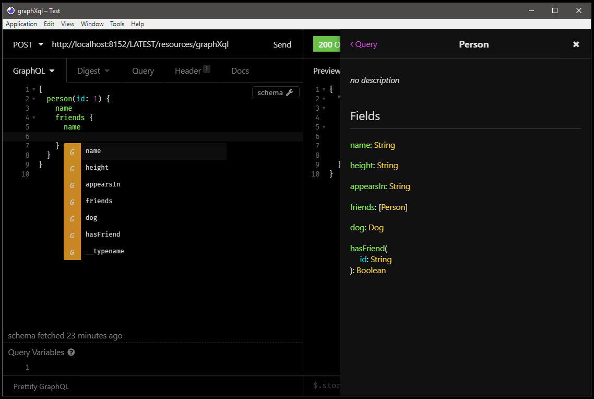
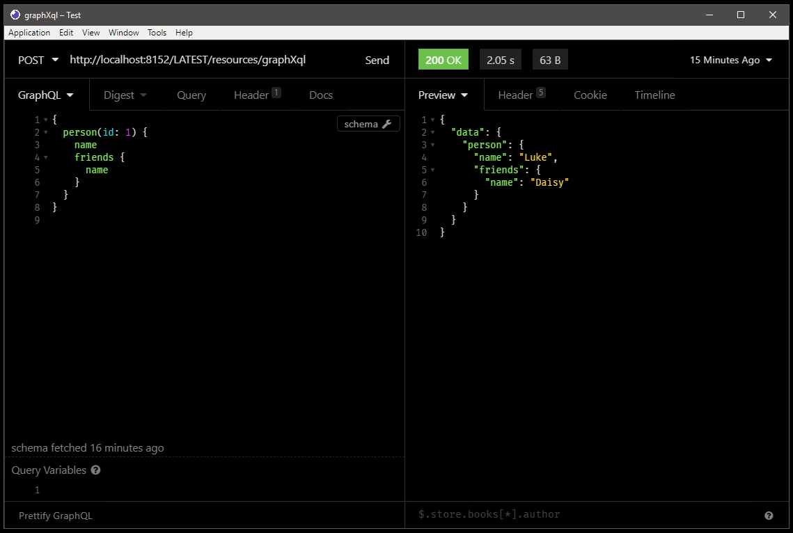

<!--  -->

# GraphXQL

> XQuery GraphQL service for Marklogic

XQuery implementation of the [GraphQL specification](http://spec.graphql.org/draft/), largely inspired from the javascript library [GraphQL.js](https://github.com/graphql/graphql-js)

This library provides a graphql service fully featured with validation, execution and introspection.

_Subscription is not yet supported._

### Prerequisites

To use the library as a dependency, you will need to have access to an instance of Marklogic, either local or remote, where you have sufficient permissions to deploy schemas, modules and load data.

In addition, if you want to deploy the library as an independent application (to run the unit tests and/or contribute to the development) you will also need to have sufficient permission to deploy a new application.

## Installing / Getting started

To expose a GraphXQL service in your project, the recommended way is to import the library as a Gradle dependency.

### Adding GraphXQL to your project

Assuming you're using ml-gradle, you can easily add a grphQL service to your application.

As this project hasn't been published to the [jcenter](https://bintray.com/bintray/jcenter) repository yet, you'll first
need to publish a copy of this project to your local Maven repository, which defaults to ~/.m2/repository. 

To do so, clone this repository and run the following command in the project's root directory:

    ./gradlew publishToMavenLocal -Pversion=1.0.0-SNAPSHOT
    
You can verify that the artifacts were published successfully by looking in the 
~/.m2/repository/graph/x/ql/graphXql directory.

Now that you've published GraphXQL locally, you can add it to your own application. You just need to add 
the following to your `build.gradle` (again, this depends on using ml-gradle).

First, in the repositories block, make sure you have your local Maven repository listed:

    repositories {
      mavenLocal()
    }

And then just add the following to your dependencies block:

    dependencies {
      mlBundle "graph.x.ql:graphXql:1.0.0-SNAPSHOT"
    }

This assumes that the version of the artifacts you published above is 1.0.0-SNAPSHOT. You can find the version number by looking at the version property in gradle.properties in your cloned copy of GraphXQL. 

Next, run the following commands:

```shell
./gradlew mlReloadSchemas
```
This will deploy the XSD schemas required to define the types used internally by the GraphQL library

```shell
./gradlew mlReloadModules
```
This will load all modules, including those coming from the GraphQL library, including the graphql service as a Marklogic Rest extension :smile:

```shell
./gradlew mlLoadData
```
This deploys the introspection graqhXql schema. You will also need to run this command when you create or modify your own graqhXql schema. (see below)

### Setup

To work, a GraphXQL service relies on a GraphXQL schema, i.e. the XML equivalent of the regular GraphQL schema based on the GraphQL SDL.
Thus you need to define a GraphXQL XML schema to expose the types supported by your endpoint. Validity of the schema is checked against [`SDL.xsd`](src/main/graphXql/ml-schemas/graphxql/SDL.xsd)

The library repository includes a sample schema [`schema.xml`](src/main/graphXql/ml-data/graphXql/schema.xml) inspired from the StarWars schema used in the GraphQL.js library

## Implement your resolvers

_All_ you have to do is to implement the resolvers which will "produce" your project specific data according to the [`schema.xml`](src/main/graphXql/ml-data/graphXql/schema.xml) mentionned above and _export_ them in the module [`export.xqy`](src/main/graphXql/ml-modules/root/graphXql/resolvers/export.xqy) which is used to connect your project specific implementation to the generic GraphXQL library.

An example implementation of [`resolvers`](src/main/graphXql/ml-modules/root/graphXql/resolvers) can be found in the library repository.

## Test your GraphQL service

Once deployed, you can test the service by sending a valid graphQL query to the service endpoint

```xquery
xquery version "1.0-ml";
declare namespace http="xdmp:http";

declare variable $graphXql-endpoint-uri := "http://localhost:8152/LATEST/resources/graphXql";

let $query :=
  '{
    person(id: 1) {
      name
      friends {
        name
      }
    }
  }'

let $payload := object-node {
  "query": $query
}

return xdmp:http-post(
        $graphXql-endpoint-uri,
        <options xmlns="xdmp:http">
            <headers>
              <content-type>application/json</content-type>
            </headers>
            <authentication method="digest">
                <username>admin</username>
                <password>admin</password>
            </authentication>
        </options>,
        $payload)
```

If everything is setup correctly, the above code should return

```xml
<response xmlns="xdmp:http">
  <code>200</code>
  <message>OK</message>
  <headers>
    <content-type>application/json; charset=UTF-8</content-type>
    <server>MarkLogic</server>
    <content-length>63</content-length>
    <connection>Keep-Alive</connection>
    <keep-alive>timeout=5</keep-alive>
  </headers>
</response>
```

```json
{
  "data": {
    "person": {
      "name": "Luke",
      "friends": {
        "name": "Daisy"
      }
    }
  }
}
```

Also, if you are working with a client application such as GraphiQL or Insomnia, you should also benefit from the introspection and have access to all the types exposed by your service.

[](docs/screenshots/introspection.png)
[](docs/screenshots/query.png)

## Developing

To contribute to the project:

First, get the latest version of the project.

```shell
git clone https://github.com/lonesloane/graphxql.git
```

Review the content of the file `gradle-local.properties` and if needed update the targeted ports for the main application and the unit-test application.
You should also review the user and password used for the deployment.

Next, deploy the application.

```shell
cd graphxql/
./gradlew mlDeploy -i
```

This will create a dedicated GraphXQL application server on your local Marklogic instance as well as the unit-tests application on a separate port.

To run the unit tests, either open the unit-test web application in your browser, or run the following command:

```shell
./gradlew mlUnitTest -i
```

### Deploying / Publishing

While working locally on the library, you might also want to test its integration in another project.

To do so, publish the library to you local Maven repository using:

```shell
./gradlew publishToMavenLocal -i
```

Then, in the project using the library as a dependency, run the following command before reloading the modules and/or the schemas

```shell
./gradlew mlInstallPlugins -i
```

When you are satisfied with the changes on your local environment, you can choose to deploy a new version on a centralized Maven repository:

```shell
gradlew publish -Pversion=YOUR_VERSION_NUMBER -i
```

as defined in the `build.gradle` file:

```groovy
publishing {
    repositories {
        maven {
            url = { "http://url.to.your.maven/repository" }
            credentials {
                username "$mavenUser"
                password "$mavenPassword"
            }
        }
    }
    publications {
        pluginPublication (MavenPublication) {
            artifactId "graphXql"
      			artifact bundleJar
        }
    }
}
```

## Contributing

This library is still in a fairly early stage, if you'd like to contribute, please fork the repository and use a feature branch.

Pull requests are warmly welcome.

1. Fork it (<https://github.com/lonesloane/GraphXQL/fork>)
2. Create your feature branch (`git checkout -b feature/fooBar`)
3. Commit your changes (`git commit -am 'Add some fooBar'`)
4. Push to the branch (`git push origin feature/fooBar`)
5. Create a new Pull Request

## Links

- Project homepage: https://github.com/lonesloane/graphxql/
- Repository: https://github.com/lonesloane/graphxql/
- Issue tracker: https://github.com/lonesloane/graphxql/issues

## Licensing

The code in this project is licensed under MIT license - see the [LICENSE](LICENSE) file for details

## Acknowledgments

- A lot of inspiration was taken from the GraphQL.js implementation, especially the parser and the validation rules.
